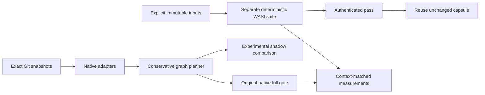

# Implementation architecture

`cmd/hayaku` delegates to `internal/app`, which coordinates packages rather than
placing framework branches in graph logic. `internal/model` owns versioned config,
evidence, unit, gap, reason and command schemas. CLI/config use the standard
library. There is no service, telemetry, AI model, credential requirement or DB.

- `snapshot`: resolves exact commit objects, inventories NUL-delimited changes,
  copies raw blobs, bounds resources and rejects unsupported entry types.
- `config`: strict schema/fields, duplicate-key rejection, context and path checks.
- `adapter`: versioned native providers and honest whole-suite fallbacks. Native
  graph identities include workspace namespaces. Discovery does not certify runtime
  dependencies. Collection side effects are explicit capability gaps.
- `graph` / `planner`: validates endpoints, unions old/new influences, follows
  dependency-to-dependent edges with cycle-safe deterministic closure. New units
  enter proposals, deleted units remain old influence evidence, unknown inputs and
  evidence gaps broaden. Declared cross-language input/consumer contracts add
  influence; declarations do not prove enforced isolation.
- `report`: JSON and human views of the same plan. Required commands and proposed
  commands are separate fields; candidate exclusions are never CI skip authority.
- `runner/golang`, `runner/vitest` and `runner/native`: native terminal reconciliation, stable
  scope/test identities, failed/skipped outcomes and missing-result rejection.
- `noderuntime`: bounded Node/dependency content identities and verified copies;
  internal npm links are allowed only within the declared installed tree.
- `adapter/vitest`: an embedded Node bridge uses three pinned Vitest/Vite API pairs
  and configured Vite transforms; the Go core does not parse TypeScript imports.
- `process` / `app`: bounded/cancellable structured argv; saved-plan reconstruction,
  source/context revalidation, execution, and disposable Go/Vitest shadow comparisons.
- `evidence`: optional private, atomic JSON advisory cache, keyed by source, context,
  installed executable bytes, policy and installed CLI bytes/implementation version. Integrity checks
  are not a cryptographic signature. Execution does not use cached metadata.
- `qualification`: finite observation validation, net-cost arithmetic and independent
  fault corpus. Nothing in this package grants production omission authority.

The standard library remains the default. The enforced WASI contract uses pinned
wazero and platform support dependencies; licenses are bundled. Introduce parsers,
SQLite or additional SDKs only when a measured workload requires them.
Mori's normalized fingerprints are not imported or used for source invalidation.

Configuration command cwd is relative to its workspace root. Plan command cwd is
relative to the Git repository. Environment values are private configuration; plans
carry digests, not inherited/configured values. Executable argv is owner-provided
policy and must not contain credentials. A context with a different host OS/arch
requires a separate actual runner; local plans do not qualify an entire CI matrix.

Limits are explicit errors, not lossy truncation: configuration 1 MiB, process output
32 MiB per stream (Go discovery separately 64 MiB), source 50k files /512 MiB total
/64 MiB blob, graph 100k nodes /1m edges. A future plugin API should preserve this
contract and require independently versioned qualification per runtime and runner.

Native Go context captures persisted effective compiler/CGO/architecture settings.
Nonempty hidden GOFLAGS rejects with a request to place scope flags in argv.
A differing PATH override rejects; explicit absolute runner paths are supported.
Discovery checks materialized raw-tree digests before/after tooling.

Declared Node runtimes are separately bounded to 250k dependency entries and
2 GiB including Node bytes. Snapshot source keeps its original strict digest;
explicit module subtrees receive independent complete digests, including modes
and internal symlink targets. Copies cannot overwrite committed inputs. Bound
Vitest runs use private copies, uncached results and private Vite caches; a newly
created empty bundler scratch directory is restored before revalidation. No
arbitrary ignore list is introduced. These checks observe before/after state;
they do not enforce hermetic execution or observe every transient side effect.

## Additional runner and enforcement packages

`catalog` describes language, build system, runner, collection, report format and
assurance separately. `adapter/native` provides installed Node, unittest, pytest,
Jest and Playwright bridges with conservative whole-workspace input ownership.
Native collection executes trusted code, and its side effects remain explicit gaps.
Named full-scope integrations preserve original commands rather than pretending to
discover test cases. Generic JUnit/TRX/Swift/libtest ingestion requires a complete
caller-bound inventory and discards diagnostic text.

`capsule` instantiates a separate WASI Preview 1 command in wazero's interpreter.
Copied memory files have canonical read-only modes/timestamps; arguments/environment,
logical clocks and seeded entropy are explicit. Imported interfaces and host calls
are validated, dangerous capabilities trap, and tables/memory/output/host calls are
bounded. Complete passes receive context-bound local authentication. Audit
invalidation precedes execution. This contract does not certify native equivalence;
Windows cache reuse remains disabled pending ACL qualification.

`inputbundle` captures explicitly selected generated trees and linked workspace
targets, emits a bounded canonical manifest and verifies new materializations.
Links are rewritten into declared mounts, while source identity is retained.
Escapes, cycles, collisions, missing inputs and observable mutation fail. It
supplies no automatic ignore list and never substitutes candidate data into BASE.
The capsule bridge verifies a private view, normalizes aliases and directory
membership into guest files, and binds the envelope manifest into producer
identity. It does not qualify original symlink/readlink or native metadata semantics.

`metrics` validates measured wall intervals and executed/reused/upstream-cached
suite evidence. Comparisons require matching source/input/runner/environment/platform/
suite identities and upstream cache states; negative savings remain visible.
`pilot` compiles Hayaku's graph tests from independent committed snapshots into
WASI with independent fresh compiler caches, counting compiler identity, capture,
build, execution/reuse, final validation and cleanup as part of actual cost.

Input envelopes additionally bound depth to 128 and manifest size to 32 MiB.
Capsules bound module/input bytes to 64 MiB, files to 4096 and arguments/environment
to 1 MiB, with combined guest output capped at 16 MiB. These are explicit failures,
not lossy truncation. Capturing a host envelope is separate from normalizing those
bytes and metadata for the guest contract.
