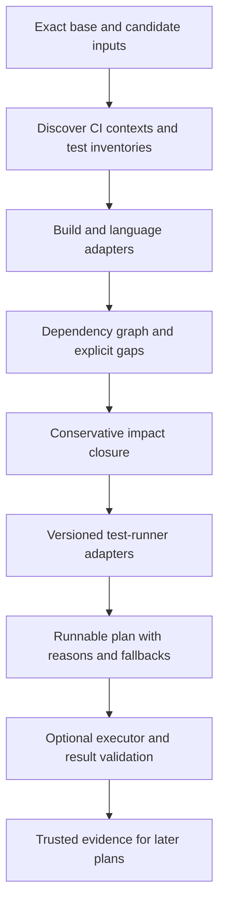

# Hayaku: proposed safety contract and architecture

Date: 2026-09-30. Status: original design proposal informed by the linked investigations. Nothing in this document is an implemented feature or measured Hayaku result.

## Recommendation

Build an explainable, deterministic CI planner that computes a conservative set of potentially affected tests. It should understand multiple ecosystems through adapters, and reduce work only within an adapter's supported safety boundary. Missing information must increase the selected scope, never silently produce fewer tests.

Meta provides a useful distinction: its isolated build graph supports conservative target selection; prediction then trades some detection for additional savings. The reported high recall is an empirical result, not universal certainty. Use prediction, if ever added, to order an already-safe set rather than remove members from it. [Primary paper, sections I and IV–VI](https://arxiv.org/pdf/1810.05286).

Stryker provides techniques for assessing test strength and speeding mutation analysis, not a universal selector for arbitrary repository changes. Mori provides an appealing portable core and language-adapter pattern, not impact semantics. See the separate investigations for their evidence and limits.

## What “100% certain” can mean

Let `T` be the current test inventory in one CI execution context; `A` the tests whose behavior could change because of the input changes under the supported model; and `S` the selected tests.

The desired invariant is `A ⊆ S ⊆ T`. This permits conservative extra tests. The much stronger `S = A` additionally requires perfect precision, which is not a credible universal product requirement.

The safety claim must name its assumptions: complete dependency/input modeling, stable execution context, supported language/build semantics, correct collection and runner behavior, and isolation from uncontrolled state. A deterministic planner is repeatable; that does not make its model complete. A complete dependency graph is a substantive requirement, not something proved by the absence of parser errors.

Arbitrary reflection, dynamic imports, filesystem enumeration, subprocesses, network services, time, randomness, shared state and concurrency can invalidate simple models. We cannot universally decide precise behavioral impact by inspecting arbitrary source. Even running the entire existing suite does not prove software correctness or eliminate flaky behavior; full fallback means Hayaku does not introduce additional selection omissions.

Practical promise to develop and validate:

> Within a documented and enforced adapter contract, Hayaku never skips a test that may be affected by modeled changes. When that contract cannot be established, it preserves the full existing test run for the uncertain scope.

This is a proposed contract, not a claim already proved. For unrestricted repositories, useful reduction and unconditional certainty cannot both be promised.

## Why common shortcuts fail

| Shortcut | Counterexample | Conservative response |
| --- | --- | --- |
| Intersect changed lines with old coverage | A new override or changed dispatch affects a test that never executed the newly added method | Use a complete enclosing dependency model; do not exclude merely because a line is absent from old coverage |
| Match source and test filenames | Shared helper, plugin registration, or fixture affects tests elsewhere | Follow reverse dependencies, including setup and data |
| Inspect imports only | A test launches a generated CLI or calls a separate backend | Model artifact/subprocess/service edges or widen the scope |
| Reuse a structural fingerprint | A constant changes while normalized syntax stays identical | Use exact content and context identities for invalidation |
| Treat unobserved reads as irrelevant | Adding a file changes a glob, or a formerly missing config now exists | Model directory membership and negative lookups, or invalidate the containing scope |
| Drop a test because it rarely fails | The next change triggers its first meaningful failure | Historical behavior may prioritize, never authorize omission in strict mode |

Some dynamic dependency techniques have conditional safety arguments; coverage-based methods are not all inherently unsafe. The concern is whether the particular collector, granularity and change model meet their assumptions. The supporting Meta note discusses this distinction.

## Proposed architecture

Keep the core separate from three concerns:

1. **Build adapters** supply workspace boundaries, configured targets, dependencies, generators, resources and execution contexts.
2. **Language adapters** enrich dependencies where they can resolve imports, dispatch and symbol relationships correctly. Parsing support alone never grants safe selection support.
3. **Runner adapters** discover runnable test identities, express selections and interpret results. They declare supported versions and granularity.

A Go CLI is a reasonable candidate given Mori's architecture and distribution pattern, but language and library choices remain open. Avoid coupling Hayaku to Mori's similarity engine. Reuse its ideas about explicit coverage, deterministic output, schema versions and immutable snapshots; independently design dependency extraction and test evidence.

Capability reporting should distinguish detected language, parsed source, resolved dependencies, discovered tests, runnable filters, and the scope where skipping is justified. A language can be recognized while its suite always uses full fallback. A supported command does not imply supported safe narrowing.

## Input and evidence contract

- Bind the plan to exact base and candidate tree identities. In merge-queue CI, the candidate is the actual merge result being tested. Never mix a merge-base diff with evidence from a different tested tree without accounting for every difference.
- For local use, include staged, unstaged and untracked inputs when that is the requested candidate. Read an immutable snapshot or detect drift and invalidate the plan. Handle paths as structured values, including spaces and renames.
- Bind each lane to its OS/architecture, toolchain, runner version, build flags, features/tags, environment contract, dependencies/lockfiles, test configuration and relevant service/image/schema identities. Do not expose raw secret values in the report or cache.
- Keep dependency information from both old and candidate states where necessary. Removed edges, deleted files and rename origins still participate in impact; commands must target only current runnable identities.
- Use exact content identities, with an explicit collision/integrity policy. Mori's lossy normalized identities must not decide whether a change is behavior-neutral.
- Reuse skip evidence only when provenance, context and completeness match. An old full run is not universally required if a complete enforced build model independently establishes exclusion, but any previous-run-dependent analysis needs compatible prior evidence.
- Cache entries and adapter versions are part of the safety contract. Unknown schema, corruption, missing history, partial collection, stale results or interrupted updates invalidate reuse. Untrusted PR artifacts must not poison trusted branch evidence.

Discovery itself can execute project code, import tests or invoke generators. It must have an explicit execution boundary; it is not automatically passive just because it is called “list tests.” This research did not invoke those workloads.

## Selection procedure

1. Establish the current CI inventory and each context's full original command. If either is unknown, report that the plan is incomplete; do not invent a successful fallback.
2. Map every relevant changed input to owners and effects using supported adapters. Record unmapped or uncertain inputs explicitly.
3. Compute reverse reachability to tests over conservative build, source, resource, generator, fixture, setup and cross-language edges. Changes to the graph itself must be included.
4. Include new/changed tests and affected collection/setup containers. A new test without compatible evidence always runs. Deleted tests leave the runnable inventory, but deletion still invalidates affected dependencies, discovery, setup and order-sensitive containers. Previous failures, flaky tests and uncontrolled integration suites need explicit rerun policy rather than being treated as reusable passes.
5. Add any positive evidence from runtime tracing/coverage. Do not prune a sound broader closure using ordinary historical coverage. Narrowing beyond it needs a separately justified adapter algorithm.
6. Expand uncertainty to all tests in the smallest **established isolation boundary**. A directory or package name alone does not prove isolation. If boundaries or outbound effects are uncertain, expand further, potentially to the repository's full test matrix.
7. Emit selected runnable scopes and reasons, excluded scopes and the evidence justifying exclusion, completeness diagnostics, and exact fallback commands.
8. At execution, revalidate candidate, context, evidence and adapter/runner identities, preserve setup/build steps, and verify observed runner selection. A changed toolchain, flag, configuration or service contract can stale a plan without changing its source tree. Unexpected missing tests, unknown IDs or incomplete reporting cause a broader rerun or a failing/incomplete result.

Subsetting can change order, global state and resource pressure. Unless tests are independent under the adapter contract, preserve the original suite container/run. Performance, stress and order-dependent tests require their own treatment; package selection does not solve them automatically.

## Conditions that should broaden a run

| Event | Proposed default |
| --- | --- |
| Unknown language, unsupported syntax or unresolved dependency | Entire established affected scope; full suite if containment is unknown |
| Changed shared setup, runner config, dependency manifest or compiler flags | All dependent contexts, conservatively full affected lane |
| Database migration, API/schema change, shared generated artifact | Include consumers and integration tests across languages; broaden if contract edges are missing |
| Runtime files, globs, reflection, plugin loading or subprocess dependencies not modeled | Full containing execution scope |
| Toolchain, image or uncontrolled external service changes | Invalidate relevant context evidence and preserve full run |
| Missing merge/base revision or snapshot drift | No narrowed plan; original full commands if known, otherwise explicit error |
| Empty selection | Allowed only with a positive exclusion argument and complete current inventory; never because discovery failed |

Do not offer a “skip anyway” switch while labeling the result safe. Explicit user exclusions are policy, not evidence of irrelevance; report them as outside the assurance boundary.

## Output and execution

The primary artifact should be structured JSON: schema, candidate identity, contexts, adapter versions, dependency/evidence identities, completeness, selected scopes, excluded scopes, reason chains, and commands as `cwd + executable + argv`. Human-readable shell text is a convenience rendering, not the authoritative execution representation.

Preserve each project's package manager, pinned runner, wrappers, build prerequisites, race/coverage flags, browser/device projects, retries and CI matrix. Avoid installing a guessed latest runner. Do not discard typechecks, lint, build checks or security checks simply because test selection is empty; they require separate impact models.

Illustrative Hayaku interfaces could be `inspect`, `plan`, `explain` and later `run`/`record`. These are design names, not available commands. A plans-only first version needs an integration that validates runner results before claiming end-to-end correctness.

## Maintaining quality and establishing confidence

Use three separate evaluation questions:

- **Selection safety:** Does the algorithm conservatively cover impact within its contract? Require adapter-specific reasoning, adversarial fixtures and property checks such as “removing evidence never reduces selection.”
- **Test effectiveness:** Do selected tests detect the faults they are meant to detect? Mutation testing can expose weak assertions, survivors and uncovered changed code. A perfect score over configured mutants is not a correctness proof.
- **CI performance:** Does the entire workflow improve? Measure discovery, analysis, storage, instrumentation, build/startup, full fallbacks and execution, not merely tests removed.

Before enabling skips, run in shadow mode alongside the original full suite on the same candidate/context. Record skipped tests whose outcomes or traces change, failing-test recall, change-level recall, selected fraction, fallback frequency, analysis overhead and wall time. Identical pass/fail outcomes alone do not show that tests were unaffected.

Replay real changes and seeded faults. Include additions/deletions/renames, new overrides, static initializers, shared fixtures, snapshots, globs and absent files, dependency/config changes, plugin discovery, FFI, generators, external services, matrix variants, corrupted caches and zero-match filters. Verify every supported emitted command against its runner's actual discovery and result format.

Any confirmed selection miss is a defect: disable narrowing for that adapter/context, restore full runs, and investigate the model. Periodic full audits provide monitoring; they do not retroactively make a missed PR gate safe. Zero misses in a pilot are useful evidence, not a proof of universal safety.

Coverage and mutation summaries from partial runs must be labeled partial unless a sound evidence-merging scheme accounts for omitted tests and changed inputs. Preserve existing quality gates during rollout.

## Bounded development path for discussion

1. Specify the contract, reason codes and structured plan; catalog full CI commands and produce full plans without skipping.
2. Pilot one coarse adapter: Go package dependencies for a Mori-like project, or hermetic build targets where input boundaries can be enforced. Shadow mode first; qualify unsupported resources and dynamic behavior explicitly.
3. Add runner integration and command conformance checks; allow narrow plans only for qualified contracts, preserving full fallback elsewhere.
4. Add a second ecosystem to prove the core is not Go-specific. Extend through independently qualified adapters rather than a single guessed universal dependency parser.
5. Consider finer case-level selection only where evidence and semantics justify it. Add optional mutation integration for quality; keep learned prioritization separate from omission authority.

No speed target is justified yet. The first useful milestone is a reproducible safe plan with clear reasons and demonstrably correct commands, followed by measured net CI savings.

## Additional primary sources

- [Bazel query reference](https://bazel.build/query/language): its dependency query is a conservative abstraction; configuration matters.
- [Bazel test environment specification](https://bazel.build/reference/test-encyclopedia): declared input access and hermeticity are central; a build-system label alone does not ensure every test obeys the contract.
- [Vitest forceRerunTriggers](https://vitest.dev/config/forcereruntriggers): explicit full-run triggers exist because module graphs miss cases such as subprocess execution.

These documents were checked on 2026-09-30. They support the stated factual observations; the architecture and policy above are proposals for Hayaku.
